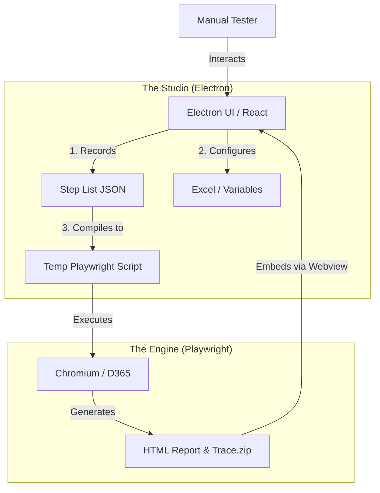

This README is designed to be your **Master Specification**. You can literally copy-paste sections of this into Cursor (the AI code editor) to tell it exactly what to build.

Here is the blueprint for **D365 QA Studio**.

-----

# 📦 D365 QA Studio

**"The Postman for D365 Automation"**
A No-Code Desktop Studio that wraps Playwright into a user-friendly recording and execution tool for Dynamics 365 Finance & Operations.

## 🎯 The Vision

We are bridging the gap between Manual QA and Automation.

  * **Manual Testers** don't want to write Typescript. They want to record flows, edit mistakes, and inject Excel data.
  * **Existing Tools** (`codegen`) are brittle and developer-focused.
  * **Our Solution:** A "Wrapper" app that records actions into a human-readable "Playlist," enables drag-and-drop parameterization, and embeds the official Playwright Trace Viewer directly in the UI.

-----

## 🏗 Architecture & Data Flow

We use a **Command Center Architecture**. The Electron App acts as the Manager, and Playwright acts as the Worker.



### 1\. The "Tape" (Storage Format)

We **DO NOT** save raw code. We save a **JSON Step List**. This allows us to build an "Edit UI" where users can change values without breaking syntax.

```json
{
  "id": "test-001",
  "steps": [
    { 
      "action": "click", 
      "selector": "[data-id='save-btn']", 
      "description": "Click Save" 
    },
    { 
      "action": "fill", 
      "selector": "[name='custAccount']", 
      "value": "{{NewCustomer}}", 
      "description": "Enter Customer ID" 
    }
  ]
}
```

### 2\. The Smart Recorder

A custom JavaScript agent injected into the browser that prioritizes D365-specific attributes over generic CSS.

  * **Priority 1:** `data-dyn-controlname` (D365 Internal ID - Most Stable)
  * **Priority 2:** `aria-label` (Accessibility Labels)
  * **Priority 3:** `role` + `name` (Playwright Locators)

### 3\. The Embedded Viewer

We do not ask users to run CLI commands. We generate the **Playwright HTML Report** and load it into an Electron `<webview>` tag, giving the user full access to the **Trace Viewer** (Screenshots, Network, Console) inside our app.

-----

## 🚀 Key Features

### 🔐 1. Smart Session Management

  * **Feature:** Login to D365 MFA once.
  * **Tech:** `context.storageState()` is saved to `auth.json`.
  * **Benefit:** Testers open the app and are instantly logged in. No 2FA fatigue.

### 🔴 2. The "Playlist" Editor

  * **Feature:** Steps appear as cards (not code).
  * **Actions:**
      * **Delete:** Remove accidental clicks.
      * **Reorder:** Drag steps up/down.
      * **Parameterize:** Click any text value (e.g., "US-001") and replace it with `{{CustomerID}}`.

### ⚡ 3. Hybrid Execution

  * **Local Run:** Executes on the user's machine (Headless or Headed).
  * **Cloud Run:** Pushes the compiled script to **BrowserStack Automate** (future phase).

### 🔍 4. Integrated Results

  * **Pass/Fail:** Instant status indicators.
  * **Deep Dive:** Clicking a failed step slides out the **Playwright Trace Viewer**, allowing users to "Time Travel" through the test snapshots.

-----

## 🛠 Tech Stack

  * **Core:** Electron (v28+)
  * **Frontend:** React + TypeScript + TailwindCSS (ShadCN UI components recommended)
  * **Engine:** Playwright (Node.js Library)
  * **Persistence:** `electron-store` (Local settings), `fs` (JSON test files)
  * **Bundling:** `electron-builder` (To package browsers inside the .exe)

-----

## 📂 Directory Structure (For Cursor)

Use this structure when creating files.

```text
/d365-qa-studio
│
├── /src
│   ├── /main              # NODE PROCESS (Backend)
│   │   ├── main.ts        # App Entry & Window Manager
│   │   ├── bridge.ts      # IPC Handlers (Frontend <-> Backend)
│   │   ├── compiler.ts    # JSON -> Playwright Code Converter
│   │   └── recorder.ts    # Manages the Recording Browser Session
│   │
│   ├── /renderer          # UI PROCESS (Frontend)
│   │   ├── /components    # React Components (StepCard, Sidebar, etc.)
│   │   ├── /pages         # RecordPage, ResultsPage
│   │   └── App.tsx
│   │
│   └── /inject            # BROWSER AGENTS
│       └── smart-spy.js   # The logic that runs inside D365 to catch clicks
│
├── /resources             # Bundled binaries
│   └── /browsers          # Playwright Chromium binaries (for offline use)
│
├── /tests-stored          # User's saved JSON files
└── package.json
```

-----

## 📝 Roadmap & "Cursor" Prompts

To build this efficiently, copy these prompts into Cursor one by one.

### Phase 1: The Shell

> "Create a robust Electron + React + TypeScript boilerplate. Configure TailwindCSS. Set up the main process to launch a window that is 1200x800. create a clean sidebar layout with tabs: 'Record', 'Data', 'Results'."

### Phase 2: The Recorder Engine

> "In `src/main/recorder.ts`, create a class that launches Playwright. It should have a `startRecording(url)` method. It needs to inject a script (`smart-spy.js`) that listens for click/input events and sends them back to the main process via `exposeBinding`. Log the events to the console for now."

### Phase 3: The "Smart Spy" Logic

> "Create `src/inject/smart-spy.js`. Write a function that determines the best selector for a clicked element. Prioritize `data-dyn-controlname`, then `aria-label`, then `text`. Send the selector + action type back to Electron."

### Phase 4: The UI Playlist

> "In the React frontend, create a `StepList` component. It should listen for 'new-step' events from Electron and render them as cards. Allow me to edit the 'value' field of input steps."

### Phase 5: The Execution & Viewer

> "Create a `compiler.ts` in the main process. It takes the JSON steps and generates a string of Playwright code. Then, run this code using `child_process`. Configure it to output an HTML report. When finished, display that HTML report in a `<webview>` in the Results tab."

-----

## ✅ Getting Started

1.  **Initialize:** `npm init electron-app@latest d365-qa-studio -- --template=typescript-webpack`
2.  **Install Engine:** `npm install playwright electron-store fs-extra`
3.  **Download Browsers:** `npx playwright install chromium`
4.  **Run:** `npm start`